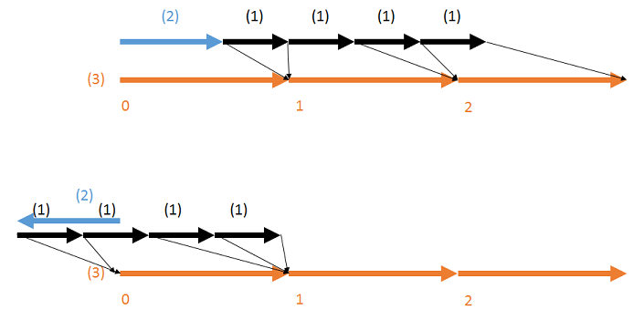

# Basic settings

## Overview

From here, you can set some global parameters for the particle node, such as its name, the number of particles to be generated, and other particle settings.

## Parameter

"Basic settings" window

### Visibility

Controls whether or not particles generated from this node are drawn on the screen. If you check this, particles will be visible. Note that even when outputting for games, particles will not be drawn unless this is checked.

### Name

Set the name displayed in the node tree. This is for organizational purposes only; to organize nodes when you have many nodes in your node tree. It does not affect the behavior of the particles in any way.

### Spawn Count

Sets the maximum number of particles that will be generated from this node. You can also choose infinite to generate particles indefinitely (or until other conditional settings described later cause the particle generation to be stopped). However, when playing an effect from another application that incorporates Effekseer, please note that the "infinite" effect will not end unless a function is manually called to stop the effect.

### Inherit Position

Sets how the position of the parent particle affects the particles generated from this node. Please refer to the following section for information regarding inheritance options.

#### Only on create - FollowParent

The child particles move to follow the parent particle.
The behavior can be controlled by the speed and steering.

<video autoplay loop="true" muted="true" src="../../movies/Reference/BasicSettings/FollowParent.mp4"/>

### Inherit Rotation

Sets how the rotation of parent particles affects particles generated from this node. Please refer to the following section for information regarding inheritance options.

### Inherit Scale

Sets how the enlargement of parent particles affects particles generated from this node. Please refer to the following section for information regarding inheritance options.

### Inherit **

#### Always

It is continuously inherited. Whenever the value of the parent particle is changed, the child particles are also immediately updated. If the parent particle despawns, the value at the time of disappearance will be what is used for inheritance from that point on.

#### Only on create

The inherited value is used to initialize the value for each child particle only once, when the child particle is first generatated.

#### Never

The value will not be inherited. Regardless of the value of the parent particle, the behavior of the particle will be determined only by the parameters of the child node.

### Destroy after time

When the number of frames spcified in "Time to live" passes, the particle will be despawned. If you do not check this, particles will not be despawned after their lifetime expires.

### Destroy with parent

When the parent particle despawns, the child particle(s) will be despawned as well.

### Destroy when no more children

If child particles of a parent particle are not present, and it is unlikely that any more children will be generated in the future, delete the parent particle.

### Time to live

Sets the number of frames that should pass between the particle being spawned, and being despawned. However, if "Destroy after time" is unchecked, this parameter has no effect.

### Spawn Rate

Sets the rate at which particles are generated. The number of frames specified will have to pass between one particle generating and the next. You can specify a value less than 1 for the spawn rate, in which case multiple particles will be generated per frame.

### Initial Delay

Specify the number of frames that must pass between generation of parent particles and the initial generation of their child particles.

A negative numerical value can also be specified as Initial Delay. The particles that are supposed to be generated at a negative time are actually generated at the 0th frame.

The following figure shows the relationship between Spawn Rate, Initial Delay and time. (1) is Spawn Rate, (2) is Initial Delay, (3) is time (frame unit). The start time is shifted by the value of Initial Delay. When Initial Delay elapses from the start time, particles are generated. However, all the particles generated at the negative time are generated in the 0th frame.

### Spawn Start Trigger

Specifies the trigger number to initiate particle generation.

If a trigger number is specified, particles will not be generated until the trigger is sent.

If the default "none" is specified, particle generation will start without sending a trigger.

See also: [15.Let's Send triggers to change effects!](../ToolTutorial/15.md)

### Spawn Stop Trigger

Specify a trigger number to stop particle generation.

If a trigger number is specified, particle generation will stop when the trigger is sent.

If the default "None" is specified, the trigger will not stop particle generation.

See also: [15.Let's Send triggers to change effects!](../ToolTutorial/15.md)

### Destroy Trigger

Specifies the trigger number for deleting particles.

If a trigger number is specified, particles existing at that moment will be deleted when the trigger is sent.

If the default "None" is specified, particles are not deleted by the trigger.

Also, if you set the `Fadeout` in the `Common panel` to `Fadeout after destroyed`, the fade out will be performed after the trigger is sent.

See also: [15.Let's Send triggers to change effects!](../ToolTutorial/15.md)
