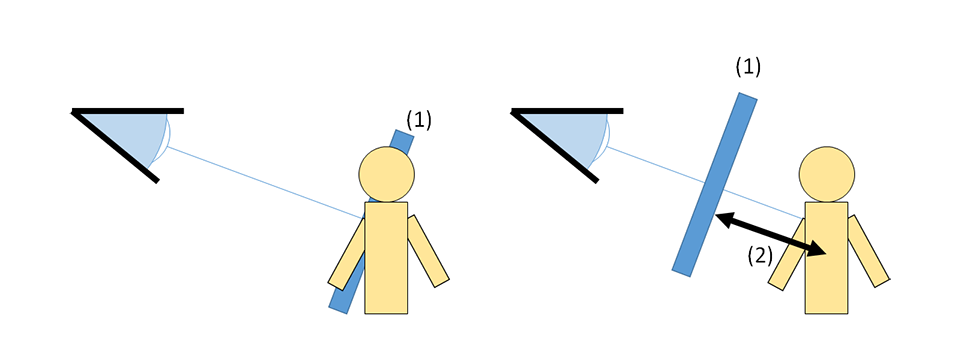
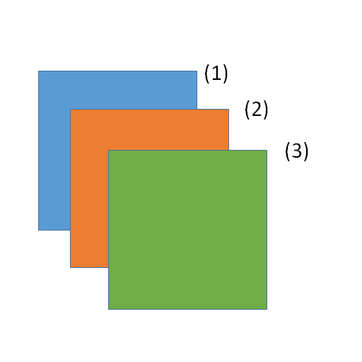

# Depth

## Overview

Set the parameters for depth-of-direction processing.

## Parameter

### Z-Offset

Moves the particle position in the depth direction when it is drawn. This parameter affects drawing only. Only particles with this parameter are moved. Child's particles are not moved in Version 1.4. For example, when drawing a hit effect, this parameter can be used to prevent that the character clips the effect.

(1) is an effect clipping the character. (2) is Z offset. You can see that Z-offset protect the character to be clipped.

<table>

<tbody>

<tr>

<td>

Z-Offset : 0

</td>

<td>

Z-Offset : 2

</td>

</tr>

<tr>

<td></td>

<td></td>

</tr>

</tbody>

</table>

### Is scaling invalid with Z offset

If Z-offset is changed, the position where an effect is drawn is moved and a distance between a camera and an effect. A size of drawn particle is changed by changing distance. This paramether specifies whether the size of particles does not change.

<table>

<tbody>

<tr>

<td>

Off

</td>

<td>

On

</td>

</tr>

<tr>

<td></td>

<td></td>

</tr>

</tbody>

</table>

### Scaling Z-Offset

Specifies whether Z-offset increases with particle's scale parameter.

<table>

<tbody>

<tr>

<td>

Off

</td>

<td>

On

</td>

</tr>

<tr>

<td></td>

<td></td>

</tr>

</tbody>

</table>

### Depth sort

Specify whether particles belonging to the same node are sorted by the distance in the depth direction. If this parameter is on, particles get a better appearance and processing becomes heavier.

<table>

<tbody>

<tr>

<td>

Off

</td>

<td>

On

</td>

</tr>

<tr>

<td></td>

<td></td>

</tr>

</tbody>

</table>

### Drawing priority

Specify the drawing order between nodes. The higher this parameter, the later particles are drawn. This parameter also affect a distortion. If the drawing priority is less than 0, distortion distorts only the background. Distortion does not distorts between particles. If the drawing priority is 0 or more, it distorts the background and particles with drawing priority less than 0.

This picture is an example of a drawing order. (1) is parent node of (2) and a drawing priority is 0. (2)'s drawing priority is 0. (3)'s drawing priority is 1. You can see that the drawing order is determined by the drawing priority and child nodes are drawn later between nodes with the same drawing priority.

### Soft particle

It is a parameter for a specific game engine. It is not reflected in Effekseer in version 1.4.
