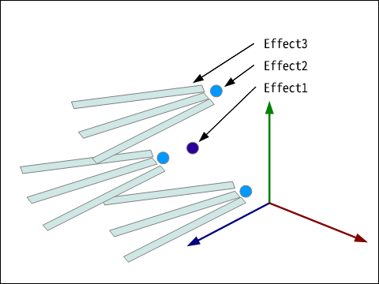

# Tool-Reference

## Overview

### Tool

This tool consists of a viewer section to preview effects and multiple windows to edit the effects' parameters. By editing the parameters in each window, you can create an effect and change its appearance and behavior. By dragging and dropping each window, you can rearrange them as you please, or collapse them into tabs. By selecting "Menu bar -> Window", you can access windows that are not visible in the default view. Also, you can reset all windows back to their default locations.

### Effect

With this tool, you create an effect by editing nodes. Nodes have parent-child relationships, where children are influenced by their parents. By utilizing the parent-child relationships, it is possible to create complex effects.

I will explain parent-child relationships using an example. In this example, node 2 is the child of node 1, and node 3 is the child of node 2\. An effect 1 particle will be generated from node 1\. After a few frames, several effect 2 particles will be generated relative to the position of the effect 1 particle generated from node 1\. After a few more frames, several effect 3 particles will be generated relative to the positions of each of the node 2 particles. This is shown in the figure below. In this way, by describing the behavior of the effect through parent-child relationships on the nodes, a much greater variety of effects can be expressed. In this tool, one effect generated based on the parameters within a "node" is called a "particle".

<div align="center"></div>

### File Format

There are two unique file formats for this tool. The first one is ".efkproj", which is a source effect file edited with the Effekseer tool. The second is ".efk", a compiled effect file to be played at runtime in a game. The ".efk" file can be exported from "File -> output" within the Effekseer editor.

## Each window

```eval_rst

.. toctree::
    :maxdepth: 1

    common
    location
    locationAbs
    locationGene
    rotation
    scale
    rendererCommon
    rendererSprite
    rendererRibbon
    rendererRing
    rendererModel
    rendererTrack
    fcurve
    sound
    network
    culling
    behavior
    record
```

## Command Line

When starting Effekseer from the command line, you can change the behavior of Effekseer by adding arguments. For example, you can convert ".efkproj" files to ".efk" without activating the Effekseer GUI. By combining this with a script, you can batch convert effect files in any folder at once.

<table border="1">

<tbody>

<tr>

<td nowrap="">-cui</td>

<td>Start up in CUI mode</td>

</tr>

<tr>

<td nowrap="">-in *</td>

<td>* open and launch</td>

</tr>

<tr>

<td nowrap="">-o *</td>

<td>Save as *</td>

</tr>

<tr>

<td nowrap="">-e *</td>

<td>Output in standard format to *</td>

</tr>

<tr>

<td nowrap="">-m *</td>

<td>Set the magnification ratio of the effect when outputting in standard format to *</td>

</tr>

</tbody>

</table>
