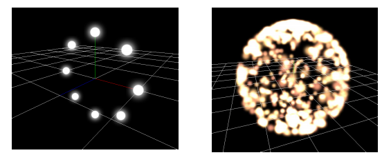
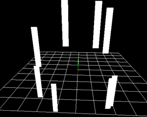
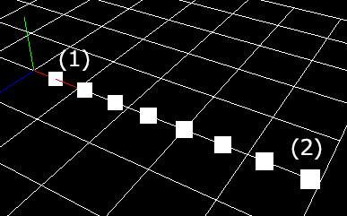
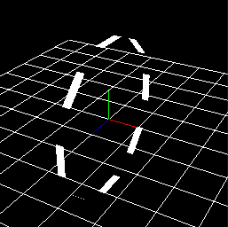
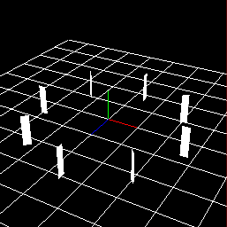
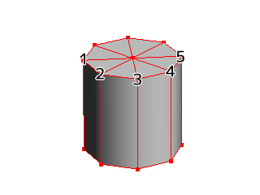

# Spawning Method

## Overview

Set parameters for specifying the position where the node's particles will be initially generated. In addition to the influence that parent particle positions have on their child particles' positions, the values set here affects position as well. In other words, particles are generated around an origin point located at the parent particle's position, then translated and rotated from that point by the parameters specified for the spawning method. 

## Parameter

### Set angle on spawn

Specify whether the parameter of the spawning method affects not only the position but also the angle. For example, if you specify "sphere", the Y direction of the generated particles will be the normal direction of the sphere.

<table>

<tbody>

<tr>

<td>Checked</td>

<td>Unchecked</td>

</tr>

<tr>

<td></td>

<td></td>

</tr>

</tbody>

</table>

### Method of Spawning

Specify how to set the generation position.

#### Point

Treats the point at the specified position as the generation position.

#### Line

Particles are placed on the line. When you specify the init position (1) and the final position (2) of the line, the particle is placed at the position where the line is divided by the number of divisions. The particle rotates so that the X direction of the particle is in the direction of the line.

##### Position noise

Noise in the distance range specified by this parameter is added to the position value where particles are generated, in the direction of the line. It is possible to suppress the sense of uniformity of the generated position.

##### Spwan Mode

###### Random

Particles are placed at randomly chosen points from each point on the line.

###### Order

Particles are placed at selected points in order from each point on the line.

#### Circle

Place the particles in a circle. At this time, you specify just the radius and rotation angle. If "Set angle on spawn" is checked, the Y direction of the particle will be normal to the surface of the circle.

##### Axis direction

Specify the direction of the axis of the circle. When checking "Influence on generation angle", the upward direction of particles is as shown in the table below.

<table>

<tbody>

<tr>

<td>

X-Axis

</td>

<td>

Y-Axis

</td>

<td>

Z-Axis

</td>

</tr>

<tr>

<td>

Arc direction

</td>

<td>

Axis direction

</td>

<td>

Outer direction

</td>

</tr>

<tr>

<td></td>

<td></td>

<td></td>

</tr>

</tbody>

</table>

##### Angle noise

Noise in the angle range specified by this parameter is added to the generated angle. It is possible to suppress the sense of uniformity of the generated position.

#### Sphere

Place the particles in a spherical shape. At this time, you specify just the radius and rotation angle of the X and Y axes. If "Set angle on spawn" is checked, the Y direction of the particle will be normal to the surface of the sphere.

#### Model

Place particles along the shape of the model for Effekseer. If "Set angle on spawn" is checked, the Z direction of the particle will be normal to the surface of the model.

Specify FBX (.fbx), metasequoia file (.mqo) used for display, or model file for Effekseer (.efkmodel). If .efkmodel is specified, .efkmodel is generated in the same directory as the specified file. When playing effects with other applications, this generated file is necessary.

You can also load FBX (.fbx) with animation. The first animation in the FBX file is played. The animation is played along the time of the parent particle. Particles are generated from the model deformed by animation.

##### Spawn Mode

###### Random

Place particles randomly along the surface of the model.

###### Vertex

Place particles on vertices in sequential order.

###### Random Vertex

Place particles randomly on any of the vertices in the model.

###### Surface

Place the particles on the center of each of the model's faces, in sequential order.

###### Random Surface

Place particles on the center of each of the model's faces, chosen in random order.

