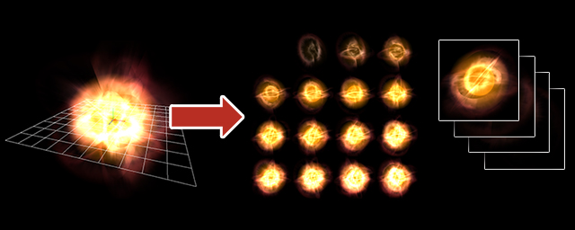
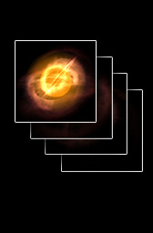

# Recorder

## Overview

Allows you to output the created effect as a sprite sheet, gif animation, AVI, etc. This function is very useful in situations such as when posting effects on your Twitter/Blog/Website/etc., or other situations where you cannot directly play effects created with Effekseer, through the runtime or otherwise.

<table>

<tbody>

<tr>

<td></td>

<td></td>

</tr>

</tbody>

</table>

## Parameter

### Resolution

#### Width/Height

Sets the output size for each frame of the animation.

#### Show guide

When checked, the bounds of the recording canvas is displayed on the screen. Anything inside the guide will be recorded, anything outside the guide will be cropped out.

### Exported Frame

#### Start Frame

Sets the frame to start recording from for outputting the image to a file.

#### End Frame

Sets the frame where recording will be stopped when outputting the image to a file.

#### Frequency (Frame)

Sets the level of frame skipping in the file output. For example, for a value of 1, when 60 frames are recorded, 60 images will be output. For a value of 2, when 60 frames are recorded, only 30 images will be output (every other frame). If you increase the number like this, the file size will become smaller at the cost of choppier animations.

### Format

There are 4 options: "Export as a single image", "Export images", "Export as a gif animation", and "Export as a AVI".

"Export as a single image" will create a sprite-sheet image with frames arranged from the upper left to the lower right. The number of frames arranged horizontally will be number specified under "X Count". Consequently, the number of frames arranged vertically will be the total number of recorded frames / X Count.

"Export images" outputs frames as individual files with numbers attached to each filename.

"Export as a gif animation" and "Export as a AVI" will output the captured effect to an uncompressed animation file.

<table>

<tbody>

<tr>

<td>Export as a single image</td>

<td>Export images</td>

<td>Export as a gif animation</td>

</tr>

<tr>

<td></td>

<td></td>

<td></td>

</tr>

</tbody>

</table>

### Options

#### Make transparent

If not checked, the background will be black; otherwise, the background will be transparent in the output. Transparency applies even for AVI files, but not for gif animations.

