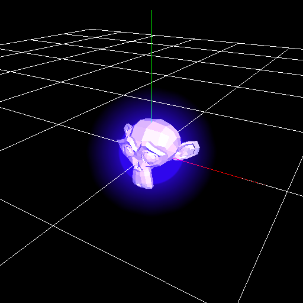
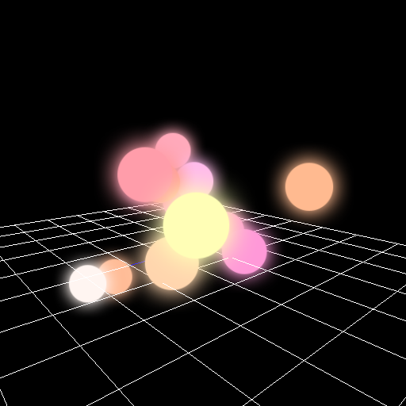

# 深度

## 概要

奥行き方向の処理に関するパラメーターを設定します。

## パラメーター

### Zオフセット

描画する時に、パーティクルの位置を奥行き方向に移動させます。 描画にのみ影響を与えます。 1.4では、このパラメーターが設定されているパーティクルのみ移動させます。子は移動されません。 例えば、ヒットエフェクトを表示する場合に、キャラクターにエフェクトがめり込まないようにするために使用できます。

(1)はキャラクターにめり込んでいるエフェクト、(2)はZオフセットです。 Zオフセットでキャラクターがエフェクトにめり込まなくなったことがわかります。

<table>

<tbody>

<tr>

<td>

Zオフセット : 0

</td>

<td>

Zオフセット : 2

</td>

</tr>

<tr>

<td></td>

<td></td>

</tr>

</tbody>

</table>

### Zオフセットによる拡大無効化

Zオフセットを使用するとエフェクトが描画される位置が移動し、カメラとの距離が変化します。 距離が変化すると描画されるエフェクトの大きさが変化します。 その変化が起きないようにするか、設定します。

<table>

<tbody>

<tr>

<td>

Off

</td>

<td>

On

</td>

</tr>

<tr>

<td></td>

<td></td>

</tr>

</tbody>

</table>

### Zオフセットの拡大

Zオフセットがパーティクルの拡大で大きくなるか、設定します。

<table>

<tbody>

<tr>

<td>

Off

</td>

<td>

On

</td>

</tr>

<tr>

<td></td>

<td></td>

</tr>

</tbody>

</table>

### 深度ソート

同じノードに属するパーティクルが奥行き方向の距離によって並び替えられるか指定します。 指定したほうが見栄えがいいことが多いですが、処理も重くなります。

<table>

<tbody>

<tr>

<td>

Off

</td>

<td>

On

</td>

</tr>

<tr>

<td></td>

<td></td>

</tr>

</tbody>

</table>

### 描画優先度

ノード間の描画順序を指定します。値が大きいほど、後に描画されます。 描画優先度は歪みにも影響します。 描画優先度が0より小さい場合、歪みは背景のみを歪ませます。パーティクル同士で歪みは発生しません。 描画優先度が0以上の場合、背景と描画優先度が0より小さいパーティクルを歪ませます。

描画順序の例です。 (1)は(2)の親のノードで描画優先度は0です。 (2)の描画優先度は0です。 (3)の描画優先度は1です。 描画優先度により描画順序が決まり、描画優先度が同じノード間では子のノードが後に描画されることがわかります。

### ソフトパーティクル

特定のゲームエンジン向けのパラメーターです。1.4現在、Effekseerには反映されません。

