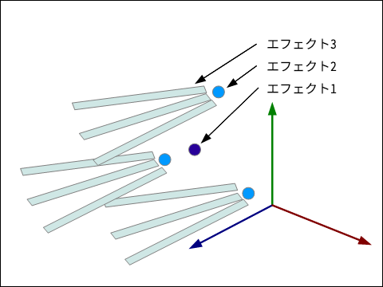

```eval_rst
=========================================
ツール・リファレンス
=========================================
```

## 概要

### ツール

このツールは、エフェクトの編集結果を表示するビュワー部分と、パラメーターを編集するための複数のウインドウで構成されています。 各ウインドウのパラメーターを編集することで、エフェクトを生成したり、見た目を変更したりできます。 各ウインドウは、ドラッグアンドドロップにより、配置を変更したりタブに変更したりすることができます。 「メニューバー->ウインドウ」を選択することで、ウインドウを選択したり、初期配置では配置されていないウインドウを表示したりできます。 また、全てのウインドウを初期配置に戻すことができます。

### エフェクト

このツールでは、ノードを編集することでエフェクトを生成します。ノード同士は親子関係を持っており、子は親の影響を受けます。 親子関係を利用することで複雑なエフェクトを生成できます。

例を用いて親子関係について説明します。この例ではノード1の子にノード2が存在し、ノード2の子にノード3が存在します。 まず、ノード1からエフェクト1が発生します。数フレーム後、ノード1から発生したエフェクトから数個のエフェクト2がエフェクト1から相対的な位置に発生します。更に数フレーム後、ノード2から発生したエフェクトからエフェクト3が発生します。これは下図に示されています。このようにして、ノードにエフェクトの振る舞いと親子関係を記述することにより、様々なエフェクトを表現することができます。 なお、このツールでは、「ノード」のパラメーターを元に生成されたエフェクトの1つあたりを「パーティクル」と呼びます。

<div align="center"></div>

### ファイル形式

このツールの独自のファイル形式は2つ存在します。 1つ目は「.efkproj」で、ツールで編集するためのエフェクトのファイルです。 2つ目は「.efk」で、ゲーム中で再生するエフェクトのファイルです。 「.efk」ファイルはツールの「メニューバー->ファイル->出力」から出力することができます。

## 各ウインドウ

```eval_rst

.. toctree::
    :maxdepth: 1

    common
    location
    locationAbs
    locationGene
    rotation
    scale
    rendererCommon
    rendererSprite
    rendererRibbon
    rendererRing
    rendererModel
    rendererTrack
    fcurve
    sound
    network
    culling
    behavior
    record
```

## コマンドライン

コマンドラインからEffekseerを起動するときに、引数を追加することでEffekseerの挙動を変更できます。 例えば、「.efkproj」のファイルを「.efk」にEffekseerのGUIを起動せずに変換できます。 これとスクリプトを組み合わせることで、任意のフォルダのエフェクトのファイルを一括で変換できます。

<table border="1">

<tbody>

<tr>

<td nowrap="">-cui</td>

<td>CUIモードで起動</td>

</tr>

<tr>

<td nowrap="">-in *</td>

<td>*を開いて起動</td>

</tr>

<tr>

<td nowrap="">-o *</td>

<td>*に名前をつけて保存</td>

</tr>

<tr>

<td nowrap="">-e *</td>

<td>*に標準形式で出力</td>

</tr>

<tr>

<td nowrap="">-m *</td>

<td>標準形式で出力するときのエフェクトの拡大率を*に設定</td>

</tr>

</tbody>

</table>

