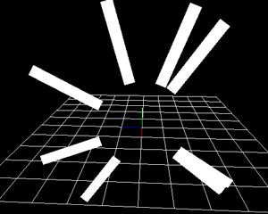
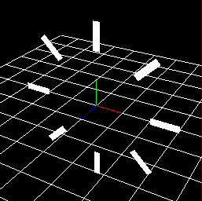
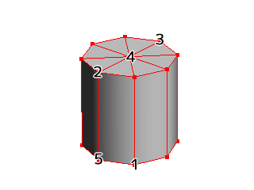
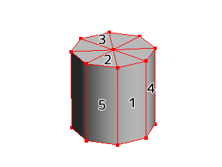

# 生成方法

## 概要

パーティクルが最初に生成される位置を指定するためのパラメーターを設定します。 親のパーティクルの位置が子のパーティクルに与える影響に加えて、ここで設定した値が影響を与えます。 すなわち、親のパーティクルの位置を原点として、この生成方法で指定した分の値だけ移動・回転した位置を中心にパーティクルが生成されます。 

## パラメーター

### 生成角度に影響

生成方法のパラメーターが位置だけでなく、角度にも影響を与えるか指定します。 例えば「球」を指定した場合、生成されるパーティクルのY方向が球の法線方向になります。

<table>

<tbody>

<tr>

<td>影響がある場合</td>

<td>影響がない場合</td>

</tr>

<tr>

<td></td>

<td></td>

</tr>

</tbody>

</table>

### 生成方法

生成方法の設定方法を指定します。

#### 点

指定した位置の点を生成方法として扱います。

#### 線(1.3以降)

線上にパーティクルが配置されます。線の始点(1)と終点(2)を指定すると、線を分割数で分割した位置にパーティクルが配置されます。 パーティクルのX方向が線の方向になるように、パーティクルが回転します。

##### 位置ノイズ

パーティクルが生成される位置の値に、線の方向に向けて、このパラメーターで指定された距離の範囲のノイズが加えられます。 生成される位置の均等感を抑制することができます。

##### 生成方法種類

###### ランダム

線上の各点からランダムに選択された点にパーティクルが配置されます。

###### 順番

線上の各点から順番に選択された点にパーティクルが配置されます。

#### 円

円状にパーティクルを配置します。この時半径と回転角度を指定します。

##### 軸方向

円の軸の方向を指定します。「生成角度に影響」にチェックを入れた場合、パーティクルの上方向は下記の表のようになります。

<table>

<tbody>

<tr>

<td>

X軸

</td>

<td>

Y軸

</td>

<td>

Z軸

</td>

</tr>

<tr>

<td>

弧の方向

</td>

<td>

軸の方向

</td>

<td>

外周の方向

</td>

</tr>

<tr>

<td></td>

<td></td>

<td></td>

</tr>

</tbody>

</table>

##### 角度ノイズ

生成される角度に、このパラメーターで指定された角度の範囲のノイズを加えます。 生成される位置の均等感を抑制することができます。

#### 球

球状にパーティクルを配置します。この時半径とX軸、Y軸の回転角度を指定します。「生成角度に影響」にチェックを入れた場合、 パーティクルのY方向は円の外周方向になります。

#### モデル

3Dモデルの形状に沿ってパーティクルを配置します。「生成角度に影響」にチェックを入れた場合、パーティクルのZ方向はモデルの法線方向になります。

表示に使用するFBX(.fbx)、metasequoiaファイル(.mqo)、もしくは、Effekseer用モデルファイル(.efkmodel)を指定します。 .efkmodel以外を指定した場合、指定したファイルと同じディレクトリに.efkmodelが生成されます。他アプリケーションでエフェクトを再生する場合、 この生成されたファイルが必要です。

アニメーション付きのFBX(.fbx)を読み込むこともできます。 FBXファイルで一番目に設定されているアニメーションが再生されます。 親のパーティクルの時間に沿ってアニメーションも再生されます。 アニメーションにより変形したモデルからパーティクルが生成されます。

##### 生成方法種類

###### ランダム

モデルの面上からランダムにパーティクルを配置します。

###### 頂点

モデルの頂点から、順番にパーティクルを配置します。

###### 頂点(ランダム)

モデルの頂点から、ランダムにパーティクルを配置します。

###### 面

モデルの面の中心から、順番にパーティクルを配置します。

###### 面(ランダム)

モデルの面の中心から、ランダムにパーティクルを配置します。

