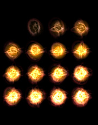

# 録画
	
## 概要

作成したエフェクトを連番画像や画像やgifアニメとして出力します。 TwitterやBlog等に作成したエフェクトを掲載する時、Effekseerで作成したエフェクトを直接再生できない時、エフェクトを再生する負荷が気になる時といった状況では、この機能が非常に便利です。

<table>

<tbody>

<tr>

<td></td>

<td></td>

</tr>

</tbody>

</table>

## パラメーター

### 録画範囲(解像度)

#### 横幅縦幅

アニメーションの1枚あたりの画像の大きさを設定します。

#### 録画範囲を表示

チェックを入れると画面に録画範囲が表示されます。

### 出力フレーム

#### 開始フレーム

ファイルに出力する映像の範囲の開始フレームを設定します。

#### 終了フレーム

ファイルに出力する映像の範囲のエフェクトの終了フレームを設定します。

#### 出力頻度(フレーム毎)

ファイルを出力する時の頻度を設定します。 例えば、1を設定した場合、60フレーム録画すると60枚画像が出力されます。 2を設定した場合、60フレーム録画すると30枚画像が出力されます。 このように数値を大きくするとファイルサイズは小さくなる代わりに映像が飛び飛びになります。

### 出力形式

「1枚にまとめて出力」「連番画像として出力」「Gifアニメーションとして出力」の3種類があります。

「1枚にまとめて出力」は、左上から右上に向かってアニメーションを配置した画像です。横方向枚数に指定した数値の数だけ横方向に画像が並びます。縦方向には録画フレーム数/横方向枚数の画像が並びます。

「連番画像として出力」は、撮影した画像に番号をつけて出力します。

「Gifアニメーションとして出力」は、撮影した画像をGifアニメにして出力します。

<table>

<tbody>

<tr>

<td>1枚にまとめて出力</td>

<td>連番画像として出力</td>

<td>Gifアニメーションとして出力</td>

</tr>

<tr>

<td></td>

<td></td>

<td></td>

</tr>

</tbody>

</table>

### オプション

#### 背景色を透明にする

チェックを入れない場合、背景は黒ですが、チェックを入れると背景が透明になって出力されます。ただし、gifアニメの場合は無効です。
