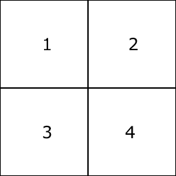

# 描画共通

## 概要

全ての描画方法に共通するパラメーターを設定する「描画共通」について説明します。

## パラメーター

「描画共通」ウインドウ

### マテリアル

パーティクルの表示に使用する材質を指定します。
光源の影響を受けたり、背景を歪ませたりといった設定をできます。

#### 標準

色画像に設定された画像をそのまま表示します。

<iframe src='../../Effects/viewer_ja.html#References/BasicRender/render_unlit.efkefc'></iframe>

#### ライティング

パーティクルが光源の影響を受けるようになります。
色画像の他に、法線画像を設定できます。
法線画像を設定すると表面の向きが変わるようになります。

<iframe src='../../Effects/viewer_ja.html#References/BasicRender/render_lit.efkefc'></iframe>

#### 歪み(背景)

背景を歪ませます。
歪み画像と歪み強度により、歪み方を設定できます。

歪みの設定が有効な場合、パーティクルが背景を歪ませるようになります。歪み方は歪み画像、各描画の色の設定、歪み強度に依存します。

歪み画像の色のうち、赤と緑を歪みの情報として使用します。両方とも値が127のとき、全く歪みません。赤が127以上の時、右方向に歪み、127未満の時左方向に歪みます。 緑が127以上の時、上方向に歪み、127未満の時下方向に歪みます。ただし、この上下左右の方向は描画方法に依存します。例えば、スプライトの場合、長方形の辺の方向で上下左右が定まります。

各描画の色は歪みの強度を弱めます。255が最大で0になると歪まなくなります。赤は左右、緑は上下に影響します。

歪み強度は全ての歪みの強さを調節します。0になると歪まなくなります。

<table>

<tbody>

<tr>

<td>

歪みあり

</td>

<td>

歪みなし

</td>

</tr>

<tr>

<td></td>

<td></td>

</tr>

</tbody>

</table>

標準設定の場合、歪みは自分のエフェクト自体を歪ませずに背景のみを歪ませます。 歪みで自分のエフェクトの他のノードを歪ませる場合、深度パネルから描画優先度を設定します。 描画優先度が0未満のノードは自分のエフェクトのノードの歪みにより、背景と共に歪ませられます。

#### ファイル

ユーザーが作成したマテリアルのファイルを表示に使用します。
最も幅広い表現を実現できます。

ボタンを押すとマテリアルのファイルを作成、編集できます。

詳細はマテリアル(執筆中)を参照してください。

マテリアルのファイルにより、そのマテリアルに応じたパラメーターが増えることがあります。
カスタムパラメーターには定数以外にもイージングやFカーブといった方法によりパラメーターを指定できます。
カスタムパラメーターの表示される名称はマテリアルのファイルによって変わります。

<iframe src='../../Effects/viewer_ja.html#References/BasicRender/render_file.efkefc'></iframe>

### ブレンド

パーティクルの表示に適用されるアルファブレンドの方法を指定します。半透明、加算、減算といった既に描画された画像に対する合成の方法を指定します。
<iframe src='../../Effects/viewer_ja.html#References/Render/blend.efkefc'></iframe>

### フィルタ

パーティクルの表示に適用されるフィルタの方法を指定します。

### 深度書き込み

パーティクルを表示するときに深度(奥行き)情報を書き込むか指定します。深度情報を書き込んだ後に、深度テストが有効になっているパーティクルを描画すると、そのパーティクルが奥にある場合、描画されなくなります。

### 深度テスト

深度テストが有効である場合、書き込まれている深度情報より奥にパーティクルが描画されなくなります。

### フェードイン

パーティクルが表示されるときに、フェードインしつつ表示されるようにします。

### フェードアウト

パーティクルが消滅するときに、フェードアウトしつつ消滅するようにします。
<iframe src='../../Effects/viewer_ja.html#References/Render/fade_in_out.efkefc'></iframe>

### UV

色/歪み画像で、実際にパーティクルの表示に使用する範囲を指定します。 使用される範囲は時間で変化させられるため、画像をアニメーションさせられます。 領域の指定に使用される数値の単位はピクセルです。

#### アニメーション

アニメーションが連続して配置されている画像を元に、アニメーションを再生します。

##### 開始時間

再生を開始するアニメーションの時間を指定します。 例えば、4枚の画像で構成されるアニメーションで2枚目から再生できます。

#### スクロール

一定の速度でUVの範囲を移動させます。

#### Fカーブ

Fカーブを使用します。

### 色への影響

親のパーティクルの色が子のパーティクルの色に影響を与えるか、を指定します。 影響を与える場合、親のパーティクルの色と子のパーティクルの色を掛け合わせた色が最終的な子のパーティクルの色になります。 「生成時のみ」を選択した場合、子のパーティクルが生成された時の親のパーティクルの色が常に適用されます。

<table>

<tbody>

<tr>

<td>

なし

</td>

<td>

生成時のみ

</td>

<td>

常時

</td>

</tr>

<tr>

<td></td>

<td></td>

<td></td>

</tr>

</tbody>

</table>

