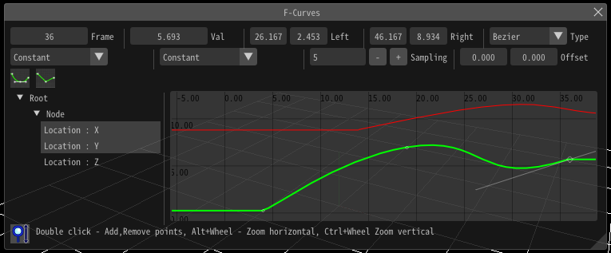

# F-曲线

## 概述

通过此功能，你可以在图表中编辑曲线，为每一帧设置数值。

## 使用方法

### 显示图表

当你为每个项目（位置、旋转等）设置了F-曲线时，它们的图表会显示在F-曲线窗口中。

当你在窗口左侧的树中选择一个项目，F-曲线就显示出来了。你可以通过按住Shift键来一次性选择多个项目。

<iframe width="560" height="315" src="https://www.youtube.com/embed/kTTrY7wjosg" frameborder="0" allow="autoplay; encrypted-media" allowfullscreen=""></iframe>

### 关于时间线

F-曲线有两种时间线。

第一种用0到100之间的数字表示，0表示粒子生成的时间，100表示粒子被销毁的时间。
如果粒子的生命周期发生变化，它仍将播放到100。

第二种直接指定帧数。时间的数值直接表示时间。

可以用时间线模式参数切换时间线。

### 移动/缩放图表

<table border="1">

<tbody>

<tr>

<td>移动图表</td>

<td>在图表中按住右键并移动鼠标。</td>

</tr>

<tr>

<td>水平缩放</td>

<td>在图表中按住Ctrl键并滚动鼠标滚轮。</td>

</tr>

<tr>

<td>竖直缩放</td>

<td>在图表中按住Alt键并滚动鼠标滚轮。</td>

</tr>

</tbody>

</table>

### 添加关键帧

你可以通过在线上双击鼠标左键添加一个关键帧。

你还可以在线上右键鼠标并通过弹出的菜单添加关键帧。

### 删除关键帧

你可以通过在关键帧上双击鼠标左键或者（在选择了关键帧的情况下）按下Delete键删除一个关键帧。

你还可以（在选择了关键帧的情况下）在关键帧上右键鼠标并通过弹出的菜单删除关键帧。

### 选择关键帧

你可以通过鼠标左键选择关键帧。

（译注：按住Shift键或Alt键可以选择多个关键帧。可以直接左键框选多个关键帧。）

### 移动关键帧

在选中关键帧后，你可以按住鼠标左键并移动鼠标以移动关键帧。通过同样的方式，你还可以移动用于控制曲线的锚点。

你还可以按下Alt键移动多个关键帧。

### 展开/收缩锚点

你可以自动设置锚点的位置，方法是选中关键帧并点击展开锚点或收缩锚点按钮。点击展开锚点按钮将展开锚点并使线更加平滑。点击收缩锚点按钮将锚点合并到关键帧的位置，使F-曲线的变化更为急剧。

### 显示整个图表

你可以左键双击图表对应的标签以显示整个图表。

## 参数

### 时间（百分比/帧）

每个关键帧分别设置。指定关键帧的时间百分比/帧。

### 值

每个关键帧分别设置。指定关键帧的值。

### 补间

每个关键帧分别设置。指定这个关键帧和相邻关键帧之间的插值方法。

### 开始

每个图表分别设置。指定如何生成图表左侧的值。

### 结束

每个图表分别设置。指定如何生成图表右侧的值。

### 采样

每个图表分别设置。指定实际播放时，使用多少帧进行插值。值越小，图表的实际形状就越精确。

### 左

每个关键帧分别设置。指定关键帧的左侧锚点的位置。

### 右

每个关键帧分别设置。指定关键帧的右侧锚点的位置。

### 最大/最小偏移

每个图表分别设置。在偏移范围内随机向上/向下移动图表。

### 时间线模式

你可以切换时间线模式。