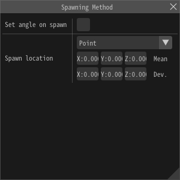
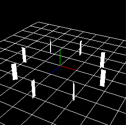
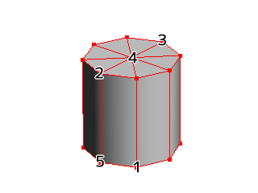

# 生成方法

## 概述

Set parameters for specifying the position where the node's particles will be initially generated. In addition to the influence that parent particle positions have on their child particles' positions, the values set here affects position as well. In other words, particles are generated around an origin point located at the parent particle's position, then translated and rotated from that point by the parameters specified for the spawning method. 

## 参数

“生成方法”窗口

### 生成时设置角度

让生成方法的参数影响角度。例如，如果勾选此项，且选择“球”，那么粒子的Y方向就会是球的法向。

<table>

<tbody>

<tr>

<td>勾选</td>

<td>未勾选</td>

</tr>

<tr>

<td></td>

<td></td>

</tr>

</tbody>

</table>

### 生成方法

指定如何设置生成的位置。

#### 点

将某个点设置为生成的位置。

#### 线

粒子会沿着线生成。当你指定了线的起点位置和终点位置时，粒子会被放置在按照顶点数分割线的等分点上。粒子的X方向会沿着线的方向（勾选“生成时设置角度”时）。

##### 位置噪声

Noise in the distance range specified by this parameter is added to the position value where particles are generated, in the direction of the line. It is possible to suppress the sense of uniformity of the generated position.

##### 生成模式

###### 随机

粒子会被随机放置在线的任意一个分割点上。

###### 顺序

粒子会依次放置在线从起点到终点的每一个分割点上。

#### 圆

Place the particles in a circle. At this time, you specify just the radius and rotation angle. If "Set angle on spawn" is checked, the Y direction of the particle will be normal to the surface of the circle.

##### 轴方向

Specify the direction of the axis of the circle. When checking "Influence on generation angle", the upward direction of particles is as shown in the table below.

<table>

<tbody>

<tr>

<td>

X轴

</td>

<td>

Y轴

</td>

<td>

Z轴

</td>

</tr>

<tr>

<td>

弧

</td>

<td>

沿轴

</td>

<td>

向外

</td>

</tr>

<tr>

<td></td>

<td></td>

<td></td>

</tr>

</tbody>

</table>

##### 角度噪声

Noise in the angle range specified by this parameter is added to the generated angle. It is possible to suppress the sense of uniformity of the generated position.

#### 球

Place the particles in a spherical shape. At this time, you specify just the radius and rotation angle of the X and Y axes. If "Set angle on spawn" is checked, the Y direction of the particle will be normal to the surface of the sphere.

#### 模型

Place particles along the shape of the model for Effekseer. If "Set angle on spawn" is checked, the Z direction of the particle will be normal to the surface of the model.

There are two types of models: file and procedural models.

If models are loaded from file, Specify FBX (.fbx), metasequoia file (.mqo) used for display, or model file for Effekseer (.efkmodel). If .efkmodel is specified, .efkmodel is generated in the same directory as the specified file. When playing effects with other applications, this generated file is necessary.

You can also load FBX (.fbx) with animation. The first animation in the FBX file is played. The animation is played along the time of the parent particle. Particles are generated from the model deformed by animation.

プロシージャルモデルを使用する場合、プロシージャルモデルのパネルでモデルを作成し、それを设置します。

If you want to use a procedural model, create a model in the Procedural Model panel and specify it.

##### 生成模式

###### 随机

Place particles randomly along the surface of the model.

###### 顶点

Place particles on vertices in sequential order.

###### 随机顶点

Place particles randomly on any of the vertices in the model.

###### 表面

Place the particles on the center of each of the model's faces, in sequential order.

###### 随机表面

Place particles on the center of each of the model's faces, chosen in random order.

