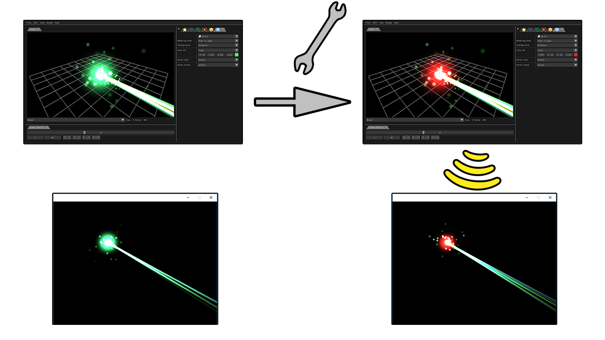

# 网络

## 概述

设置与网络有关的参数。你可以通过网络在集成了Effekseer运行时的外部应用程序中编辑特效。Unity、虚幻引擎4和其他使用Effekseer官方提供的插件的程序都可作为编辑环境。对于其他环境，咨询向该环境中集成Effekseer运行时的人。

## 如何使用

### 编辑特效的一侧（应用程序、游戏等）

这取决于插件或者库。为了通过网络编辑特效，指定用于通信的端口。
执行一个函数以启动服务器的通信，或者让函数自动执行。然后播放你要编辑的特效。

### Effekseer

在Effekseer中，打开你想编辑的特效的原始文件。在网络面板上设置连接目标并连接。编辑特效并按下“发送数据”按钮。这样程序中的特效就被编辑了。

### 限制

由程序读取的efk文件的名字必须和编辑的文件的名字相同。例如，如果应用程序中播放“Laser.efk”，则工具中必须编辑“Laser.efkproj”。此外，编辑将不会影响程序中不存在的图像、模型和声音。

### 提示

当在同一台计算机上运行应用程序时，地址设置为127.0.0.1。

## 参数

### 地址

输入运行应用程序的计算机/服务器的IP地址或DNS。

### 端口

输入运行应用程序的计算机/服务器的端口。

### 自动连接

如果尚未建立连接，将会每隔一段固定的时间间隔尝试连接到远程应用程序。

### 载入时发送数据

当读取特效文件时，如果连接已建立，将特效数据发送给应用程序。

### 编辑时发送数据

当编辑特效文件时，如果连接已建立，将特效数据发送给应用程序。

### 保存时发送数据

当保存特效文件时，如果连接已建立，将特效数据发送给应用程序。

### 发送数据

强制发送数据给应用程序。

### 连接

连接到指定远程应用程序。
