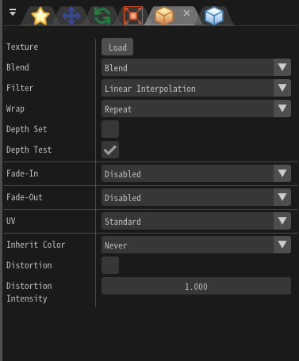

# 基础渲染设置

## 概述

本章讲解“基础渲染窗口”，它提供了用于控制当前粒子渲染的基础参数。

## 参数
<div align="center">

<p>“基础渲染设置”窗口</p>
</div>

### 材质

设置用于绘制粒子的材质。
你可以设置光照对粒子的影响或者扭曲背景之类。

#### 默认

粒子将直接显示贴图的颜色。

<iframe src='../../Effects/viewer_zh_CN.html#References/BasicRender/render_unlit.efkefc'></iframe>

#### 照明

粒子会受到光照的影响（出现明暗）。
除了用于提供颜色的贴图（可以称为漫反射贴图）外，还可以设置法线（Normal）贴图。
设置了法线贴图之后，表面的方向会被改变。

<iframe src='../../Effects/viewer_zh_CN.html#References/BasicRender/render_lit.efkefc'></iframe>

#### 扭曲（背景）

如果启用了扭曲，粒子将会扭曲它后面的任何东西。扭曲的方式取决于扭曲贴图的像素数据和扭曲强度。

扭曲贴图的红色和绿色通道将被用作扭曲信息。它们的值为127时，不会产生扭曲效果。当红色通道的值超过127时，背景将向右扭曲，小于127时，背景将向左扭曲。绿色通道的值大于127时，背景将向上扭曲，小于127时，背景将向下扭曲。但是，这里的上下左右取决于渲染方法。例如，渲染方法为精灵时，上下左右方向垂直于图片的四个边。

The color of each drawing weakens the strength of distortion. Values range between 0 and 255\. Red affects left and right, and green affects up and down.

Distortion strength adjusts the strength of all colors. When it reaches 0, no more distortion will be applied.

<table>

<tbody>

<tr>

<td>

扭曲

</td>

<td>

无扭曲

</td>

</tr>

<tr>

<td></td>

<td></td>

</tr>

</tbody>

</table>

In the case of the default settings, the distortion distorts only the background without own effect itself. To distort other nodes of own effect with distortion, specify the drawing priority from the depth panel. Nodes with drawing priority less than 0 are distorted with the background due to the distortion of the node of own effect.

#### 文件

你可以用用户创建的材质绘制粒子。
You can use a user-created material file for drawing particles.
The widest range of expressions can be achieved.

Press the button to create and edit material files.

See the reference about Material for details.

More parameters may be emerging depends on the material file.
In addition to constants, custom parameters can be specified by easing or F-curve.
The displayed name of the custom parameter depends on the material file.

##### 缓存

To speed up material loading or to play the effect on certain platforms, you can save the material as a compiled format.
To generate that file, press ``Generate Cache`` after loading the material.

If the generated cache is placed in the same directory as the material file, loading will be faster.
On some platforms, effects cannot be played without using cache.
A cache that can be used on both Windows and Mac is generated by generating the cache on Mac after generating the cache on Windows.

<iframe src='../../Effects/viewer_zh_CN.html#References/BasicRender/render_file.efkefc'></iframe>

### Emmisive Scaling

It multiplies the particle's color by the specified value. The higher the value, the brighter the color. When the value is 1, the image will be used as is.
Only available when the material is Standard or Lighting.
In environments other than those that support HDR, increasing the value may result in strange colors.

```eval_rst
.. image:: ../../img/Reference/BasicRender/EmmisiveScaling.png
   :align: center
```

### 混合

Specifies the method of alpha blending applied when displaying the particle. This controls how drawn images will be composited when they are on top of each other, such as translucency, addition, or subtraction.


### 过滤

Specify the filtering method to be applied when displaying the particle.

### Depth Set

Specify whether to write depth information when displaying particles. After writing the depth information, if you draw the particles for which the depth test is enabled, if the particles are deep inside, they will not be drawn.

### 深度测试

If the depth test is valid, particles will not be drawn deeper than the written depth information.

### 淡入

When a particle is first spawned, it fades in over a duration until fully visible.

### 淡出

When a particle is about to be despawned, it fades out over a duration and disappears.
<iframe src='../../Effects/viewer_zh_CN.html#References/Render/fade_in_out.efkefc'></iframe>

### UV

In an image, this specifies the region of the image actually used when displaying the particle. 
The region can be changed over time, allowing you to scroll or animate the image. 
The units used in these parameters for specifying the area are pixels.

#### 动画

Play animation based on images with animations arranged in succession.


##### Start time

Specify the time of animation to start playing. For example, you can play from the second piece with animation composed of 4 images.

##### Flip Frame BlendType

- None

It switches the position to be displayed at regular intervals.

<div class="video_center"><video autoplay loop="true" muted="true" src="../../movies/Reference/BasicRenderSettings/Flip_None.mp4"/></div>

- Lerp

It uses linear completion for animation transitions.
This will ensure that the image does not change suddenly.

<div class="video_center"><video autoplay loop="true" muted="true" src="../../movies/Reference/BasicRenderSettings/Flip_Lerp.mp4"/></div>

#### 滚动

Move the UV range at a constant speed.


#### F-曲线

Use the F-Curve window to control the UV by defining automation curves.

### Referenced(UV)

Multiple images with different sizes may be used for one particle.
In that case, you can specify a resolution used as the basis of the ratio with an image.
You can also specify the UV based on 128x128 without specifying the image.

When using a material, the number of ```Referenced``` matches the material a priority of image.


### 继承颜色

Specify whether the color of the parent particle affects the color of the child's particles. In case of inheritance of color, the color of the parent's particle multiplied by the color of the child's particle becomes the color of the final child's particle. When "Only on create" is selected, the color of the parent particle when the child particles are generated is always applied.

<table>

<tbody>

<tr>

<td>

从不

</td>

<td>

仅生成时

</td>

<td>

始终

</td>

</tr>

<tr>

<td></td>

<td></td>

<td></td>

</tr>

</tbody>

</table>

