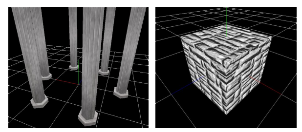

# 渲染 - 模型

## 概述

这里我们解释在渲染设置窗口中选择了“模型”时，影响渲染的参数。

在选择了“模型”时，可以导入并显示一个外部的3D模型。

在基础渲染设置窗口设置的颜色/扭曲图案可用于模型的纹理。如果不启用深度写入和深度测试，一些模型可能显示不正确。

## 参数

“渲染设置”窗口

### 模型

有两种类型的模型：文件和程序化模型。

如果从文件加载模型，需指定FBX（.fbx），水杉（.mqo）或Effekseer的模型文件（.efkmodel）。如果指定了.efkmodel以外的文件，将在与指定文件的同一目录下生成.efkmodel。如果你想在其他应用程序中播放特效，这个生成的文件是必需的。

也可以加载带有动画的FBX（.fbx）。会播放在FBX文件中设置的第一个动画。

如果你想使用程序化模型，请在程序化模型面板中创建一个模型并指定它。

### 放置方法

指定如何绘制粒子的模型。选择“告示牌”时，模型总是面向摄像机。选择“Z轴旋转告示牌”时，模型面向摄像机，但是Z轴被锁定了。选择“固定Y轴”时，模型面向摄像机，但是Y轴被锁定了。选择“固定”时，模型将会符合粒子的旋转设置。

<iframe src='../../Effects/viewer_en.html#References/Render/model_configuration.efkefc'></iframe>

### 剔除

指定模型的哪个/哪些面会被显示。

### 整体颜色

指定整个模型的色调。
