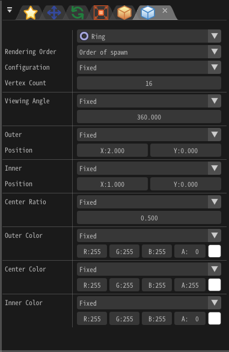
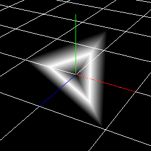

# 06. 创建环形粒子!

## 概要

在本章中, 你将使用环形(Ring)绘制方法创建多种效果。
我们已经介绍了绘制方法中的“精灵”，而这次，我们将介绍“环”。
顾名思义，它被用来绘制环形粒子。
但通过改变其参数, 你创建的特效将不会仅局限于环形。

<div align="center">

<p>各种环形特效</p>
</div>

此外，也可以尝试通过改变贴图的选区(UV)获得更好的表现效果。

<div align="center" class='col-md-4'>
<iframe src='../../Sample/viewer_en.html#06_02_Sample/effect1.efk'></iframe>
<p>本章中创建的第一个效果</p>
</div>

<div align="center" class='col-md-4'>
<iframe src='../../Sample/viewer_en.html#06_02_Sample/effect2.efk'></iframe>
<p>本章中创建的第二个效果</p>
</div>

<div align="center" class='col-md-4'>
<iframe src='../../Sample/viewer_en.html#06_02_Sample/effect3.efk'></iframe>
<p>本章中创建的第三个效果</p>
</div>

<p>你可以通过下面的链接下载为本章内容预先创建好的效果</p>
<div align="center">
<p><a href = "../../Sample/06_01_Sample.zip">下载</a></p>
</div>

## 基础圆环

你将要创建的第一个效果是一个随时间改变形状的圆环。

请打开 effect1.efkefc。

为达到预想的效果，你需要将绘制方法设置为环形。
在节点树中选中Node，切换到“渲染设置(Render Settings)”选项卡，将绘制方法由“精灵(Sprite)”改为“环(Ring)”

<div align="center">

<p>修改完成后的渲染设置应当如此图所示</p>
</div>

修改完成后播放效果，你应当看到预览画面中显示的是一个圆环。

<div align="center">

<p>环</p>
</div>

你可以通过改变其参数来改变它的形状。

圆环的形状由“渲染设置”选项卡中的外沿(Outer)和内沿(Inner)控制。
在这两项中，你可以指定圆环内外沿的平面半径(x)和轴向高度(y)。(译者注:类似圆台的上下表面半径及其高度)

<b> 注意：不要将这里的xy与预览画面中的xyz相混淆 </b>

<div align="center">

<p>外沿(1)和内沿(2)</p>
</div>

这些参数也可以通过缓动来达到随时间变化的效果。

根据如下表格修改粒子节点的参数。它表示```外沿位置```将会由(1,2)变为(3,0)而```外沿位置``保持在(1,0)不变。

|选项卡|参数|数值|
|:----|:----|:----|
|基础设置|生存时间|60|
|旋转|角度|x=0, y=0, z=-45|
|渲染设置|外沿Outer|缓动|
|渲染设置|外沿Outer-Start(平均)|x=1, y=2|
|渲染设置|外沿Outer-End(平均)|x=3, y=0|

播放效果，你可以看到圆环的形状在随时间改变了。
基于同样的原理，只需将内沿半径设为0，你就可以创建圆盘/圆锥效果了。

<div align="center">

<p>内沿不变, 外沿缓动</p>
</div>

## 三角形

你将要创建的第二个效果是一个三角形。
请打开 effect2.efkefc。

通过改变圆环的顶点数，你可以绘制出多种形状。
顶点数的初始值较大，因此粒子看起来更像是个圆，
降低顶点数则允许你绘制出三角形，矩形，六边形等形状。
你只需要将“渲染设置”选项卡中的顶点数(Vertex Count)修改为3，即可得到一个三角形，如图所示。

<div align="center">

<p>一个三角形</p>
</div>

## UV Scroll

The third effect you create is a ring with an image.

Please open effect3.efkefc.

You can also specify an image to the ring.
By specifying the image, expression of the shock wave and the aura which blows up etc. becomes easier.

Let's specify the image immediately. Select "Scroll.png" from the "Basic Render Settings" window.

You can see that the color of the ring has changed from single color to image.

<div align="center">

<p>Image</p>
</div>

However, this is not appetizing. If you change the image according to the passage of time, it looks better.
In Effekseer, you can change the area (UV) of the image used for particles.

Let the area of the image used for the particles move over time.

Change UV from "Basic Render Settings" window.
Change UV ```Standard``` to ```Scroll```.
Then, nothing is shown.
This is because you have not set the area of the image to use.

Enter the image size (256, 256) in the size. Next, enter (0, 5) as the moving speed.

You can see that the image is moving.

<div align="center">

<p>UV Scroll</p>
</div>

Finally, I made it possible to download the effect created in this chapter.

<div align="center">
<a href = "../../Sample/06_02_Sample.zip">Download</a>
</div>

## 总结

本章节中，你通过圆环绘制方法创建了一系列效果。
在下一章节，你将利用节点父子关系创建复杂的效果。